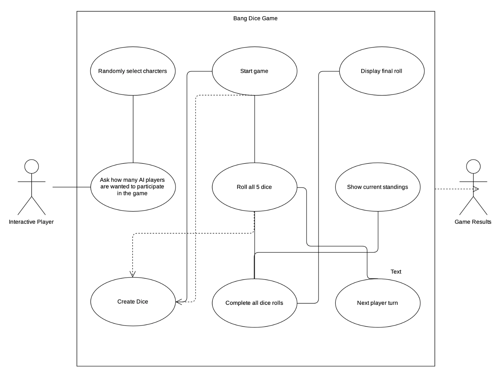
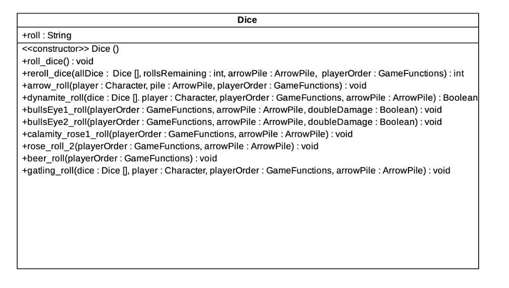
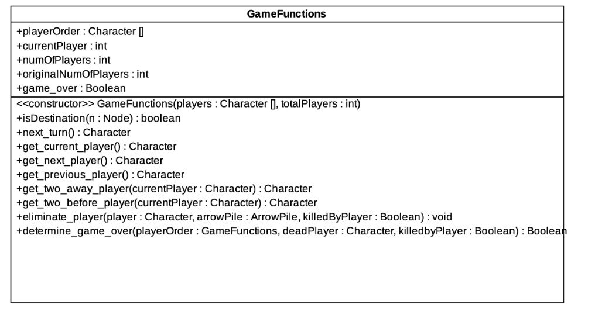
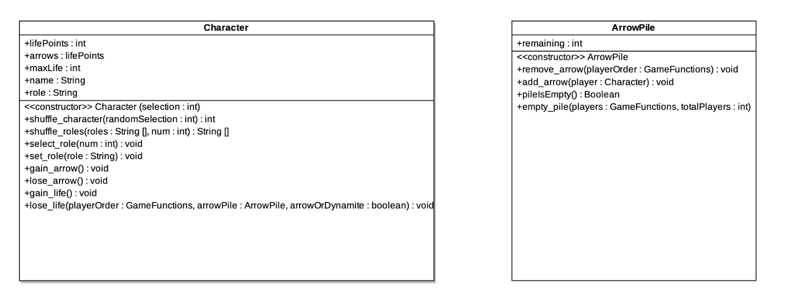
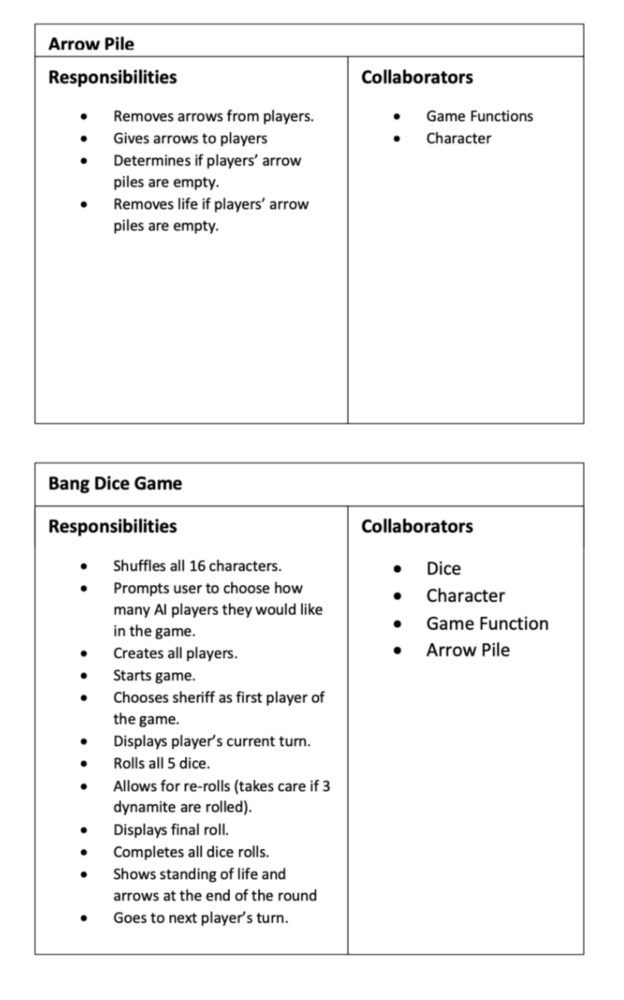
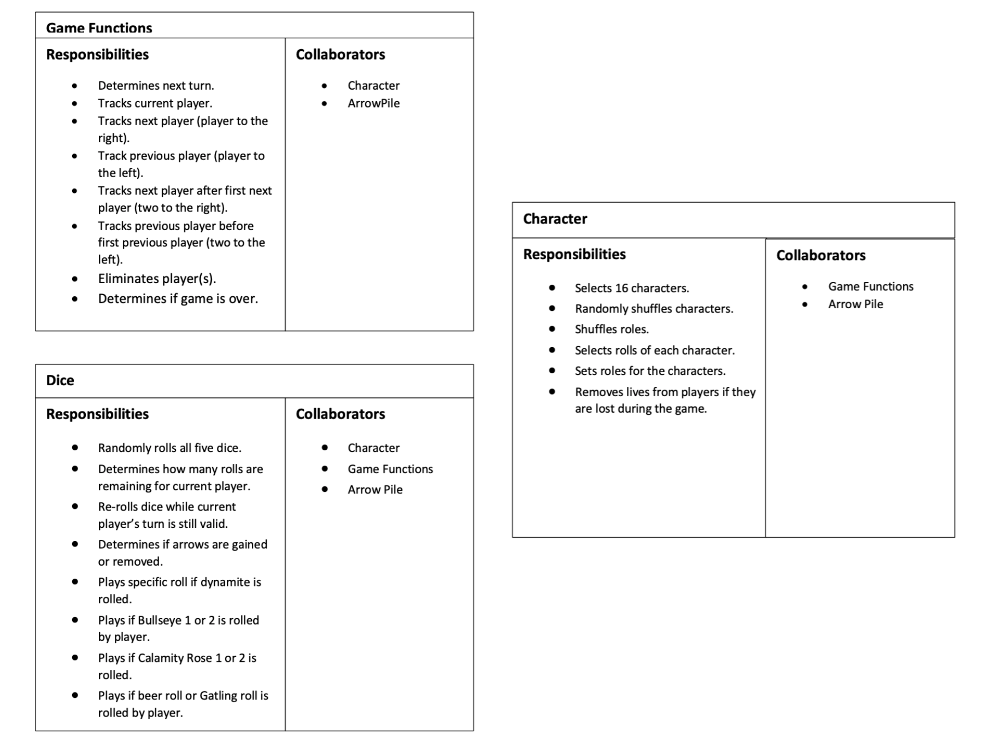
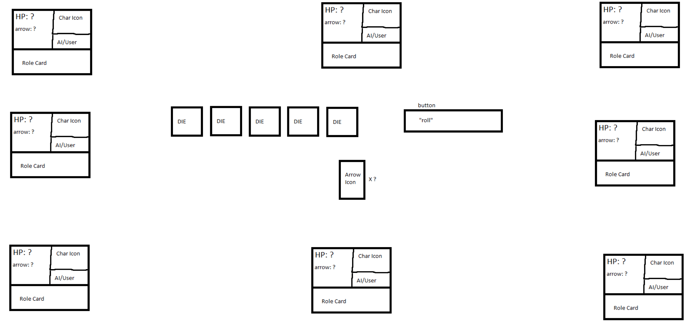

# Bang! The Dice Game
This repository is for an OOP project that we had for our OOP course. We had to recreate a GUI Bang! the Dice Game using JAVA. This repository contains our attempt.

**Rules:** [Game rules](http://www.dvgiochi.net/bang_the_dice_game/BANG!_dice_game-rules.pdf)

## Current Status
The program allows the user to play the game on the command line against the AI.

## Assignments
Johnathan Gressick: GUI

Meghan Engert: UML Use Case Diagrams, UML Class Diagrams, CRC Cards, Arrow Pile Class

Cierra Ditmore: Character and Game Functions Classes

**Sadman Ahmed Shanto:** Development of AI logic and gameplay simulation. 

Garrett Olsen: Main Class along with getting everything to work well together.

### AI logic
Each AI upon construction is allocated certain behavior parameters that dictate their playing style.

```java
//Behavior defining parameters
private double willingToTrick;
private double Aggressiveness;
private double Safetiness;
private double Niceness;
private double willingToKeepDice;
private double willingToKeepHealth;
private double willingToKeepShots;
private double willingToKeepArrow;
private double willingToKeepGatling;
private double SkepticProbability;
private double Stubbornness;
```
When it is not the AI's turn, it observes the game and records the following in its memory.

* Players who shot sheriff
* Players who gave beers to sheriff

Using, the initial distribution of roles and number of players and such information the AI assigns proabilities for certain roles to each player in the form of a probability vector. 
```java
ArrayList<Double> ProbabilityVector;
//P Vector has form [P(sheriff), P(renegade), P(outlaw), P(deputy)]
//for example if the game started out with 5 players, the P Vector for any given player before
//role is revealed would be as follows:
// [1./5, 1./5, 2./5, 1./5]
//after role information is revealed, e.g. player is sheriff, the vector is updated
// [1.0, 0.0, 0.0, 0.0]
// the probability vector is always stays normalized
//in general, depending on a certain player's interaction with the sheriff the AI updates the
//ProbabilityVector by an amount corresponding to its SkepticProbability value.
//this approach encapsulates the skeptic nature of a player and their attentiveness to the
//events in the gameplay
```
When it is the AI's turn, it rolls the 5 dices and keeps each die with a certain willing to keep probability and a payoff matrix that determines the AI's strategy and the effectiveness of a certain dice roll. The number of reroll's is also determined stochastically with some strategy.

To resolve the die, the AI employs the following algorithm.

* based on its role determine target roles (i.e. whether to shoot or help sheriff) 
* based on the probability vector, assign all other players a guessed role (i.e. the role corresponding to the element in the vector with the highest number (always normalized))
* always resolve any arrows first
* see if there is three dynamite's in which case the turn ends and no reroll is allowed
* based on current life points and target roles evaluate whether to keep beer for itself or pass to someone who would help the AI in is objective
* using a similar approach for the bull's eyes 1 and 2
* depending on the number of Gatling adjust the probability of keeping the gatling (i.e. the willingness to keep gatling increases if there is 2 or more gatlings (constrained to 3))


## To Do List
- [ ] Successful debugging of command line version of the game
- [ ] GUI implementation
- [ ] Addition of extenstion pack
- [ ] Project Video/Presentation 

## Active Issues
- [ ] Player turn not ending even when the player is dead in that round.

# Documentation

## UML Use Case Diagrams

## UML Class Diagrams




## CRC Cards



## GUI Plan


